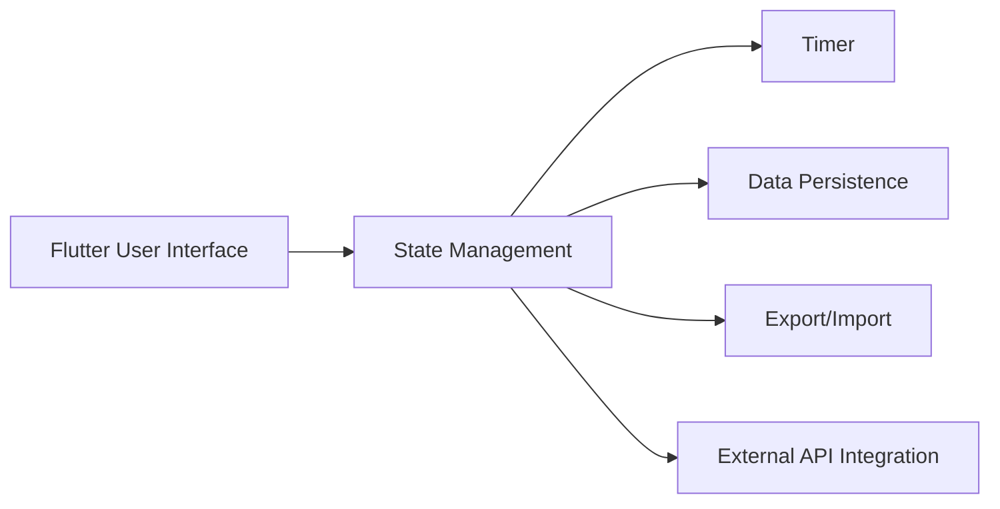

# LiveSplit Flutter

---

## Executive Summary

LiveSplit Flutter is a cross-platform application designed to facilitate tracking and managing times in speedrunning. Built with Flutter, it allows users to create, modify, and share splits intuitively and efficiently, offering a smooth experience on both mobile and desktop devices. An autosplitter feature is currently under consideration as a conceptual addition to automate split detection, though it is not yet implemented and is currently not feasible on macOS due to system limitations.

---

## Technology Stack

- **Frontend:** Flutter (Dart)
- **State Management:** Provider / Riverpod (depending on implementation)
- **Persistence:** SQLite / Shared Preferences
- **Version Control:** Git
- **CI/CD:** GitHub Actions / Codemagic
- **Testing:** Flutter Test, Mockito

---

## Features

- Creation and editing of custom splits.
- Timer with millisecond precision.
- Export and import of splits in standard formats.
- Cross-platform support: iOS, Android, Windows, macOS, Linux.
- Graphical visualization of progress and statistics.
- Integration with popular speedrunning platforms.
- Dark mode and theme customization.
- Configurable notifications and alerts.
- Autosplitter (conceptual feature under consideration; not yet implemented and currently not feasible on macOS due to system limitations).

---

## Mini-Architecture



- **User Interface:** Flutter widgets rendering the visual experience.
- **State Management:** Controls data flow and updates.
- **Timer:** Logic to measure and control timing.
- **Persistence:** Locally stores splits and settings.
- **Export/Import:** Allows sharing and loading configurations.
- **API:** Communication with external services for additional data.

---

## Code Example

```dart
// Start a simple timer
class TimerModel extends ChangeNotifier {
  Stopwatch _stopwatch = Stopwatch();
  Timer? _timer;

  String get elapsed => _stopwatch.elapsed.toString().split('.').first;

  void start() {
    _stopwatch.start();
    _timer = Timer.periodic(Duration(milliseconds: 100), (_) => notifyListeners());
  }

  void stop() {
    _stopwatch.stop();
    _timer?.cancel();
    notifyListeners();
  }

  void reset() {
    _stopwatch.reset();
    notifyListeners();
  }
}
```

---

## Workflow

1. **Clone the repository:**
   ```bash
   git clone https://github.com/usuario/livesplit_flutter.git
   cd livesplit_flutter
   ```

2. **Install dependencies:**
   ```bash
   flutter pub get
   ```

3. **Run the application:**
   ```bash
   flutter run
   ```

4. **Testing:**
   ```bash
   flutter test
   ```

5. **Contribute:**
   - Create a branch with the new feature.
   - Make clear and descriptive commits.
   - Open a Pull Request for review.

---

## Contributions

Contributions are welcome! To collaborate:

- Review open issues to find tasks or report bugs.
- Follow Dart and Flutter coding style.
- Ensure tests pass before submitting a PR.
- Document any significant changes in the README.

---

*This document will be updated as the project development progresses.*
